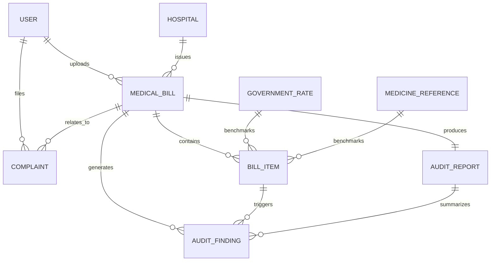

# Domain Model for Medical Bill Auditor

This document describes the core business entities expected in the Medical Bill Auditor system. It is intentionally documentation-only and does not define SQLAlchemy models, database tables, or application code.

## 1. User

### Purpose
Represents a person who uses the platform to upload bills, review findings, and manage complaints.

### Main attributes
- id
- full_name
- email
- role
- created_at
- updated_at

### Relationships
- A User may upload one or more Medical Bills.
- A User may create one or more Complaints.

## 2. Hospital

### Purpose
Represents a healthcare provider or facility associated with a bill.

### Main attributes
- id
- name
- address
- city
- state
- country
- registry_number
- created_at

### Relationships
- A Hospital may have many Medical Bills.

## 3. Medical Bill

### Purpose
Represents a hospital invoice or itemized bill submitted for audit.

### Main attributes
- id
- user_id
- hospital_id
- bill_number
- patient_name
- patient_id
- admission_date
- discharge_date
- hospital_bill_type
- invoice_date
- grand_total
- currency
- status
- uploaded_at
- source_file_path

### Relationships
- A Medical Bill belongs to one User.
- A Medical Bill belongs to one Hospital.
- A Medical Bill contains many Bill Items.
- A Medical Bill can generate many Audit Findings.
- A Medical Bill can be linked to one or more Complaints.
- A Medical Bill can produce one Audit Report.

## 4. Bill Item

### Purpose
Represents a single line item inside a medical bill such as a medication, procedure, room charge, or service.

### Main attributes
- id
- bill_id
- description
- quantity
- unit_price
- total_price
- category
- service_code
- is_medicine
- is_procedure
- department
- matched_reference
- audit_status
- created_at

### Relationships
- A Bill Item belongs to one Medical Bill.
- A Bill Item may be compared against Government Rates and Medicine References.
- A Bill Item may be associated with one or more Audit Findings.

## 5. Audit Finding

### Purpose
Represents an anomaly, overcharge, or suspicious pattern detected during analysis of a bill.

### Main attributes
- id
- bill_id
- item_id
- severity
- finding_type
- title
- description
- confidence_score
- status
- created_at

### Relationships
- An Audit Finding belongs to one Medical Bill.
- An Audit Finding may be linked to one Bill Item.

## 6. Government Rate

### Purpose
Represents a benchmark or regulated rate used to compare billed charges against expected values.

### Main attributes
- id
- jurisdiction
- scheme_name
- version
- procedure_code
- service_name
- rate_amount
- currency
- effective_date
- source_reference

### Relationships
- Government Rate may be used to evaluate many Bill Items.

## 7. Medicine Reference

### Purpose
Represents a reference record for medication pricing or standard usage that can help identify abnormal billing patterns.

### Main attributes
- id
- generic_name
- brand_name
- strength
- unit
- reference_price
- currency
- manufacturer
- source_reference

### Relationships
- Medicine Reference may be used to evaluate many Bill Items.

## 8. Complaint

### Purpose
Represents a report or formal complaint filed by a user about a bill or suspected overbilling.

### Main attributes
- id
- user_id
- bill_id
- complaint_type
- description
- status
- submitted_at
- resolution_note

### Relationships
- A Complaint belongs to one User.
- A Complaint may relate to one Medical Bill.
- A Complaint may reference one or more Audit Findings.

## 9. Audit Report

### Purpose
Represents the final summarized output of the audit workflow for a medical bill.

### Main attributes
- id
- bill_id
- summary
- generated_at
- status

### Relationships
- An Audit Report belongs to one Medical Bill.
- An Audit Report may summarize many Audit Findings.

## Overall system flow

1. A User uploads a Medical Bill.
2. The system parses the bill and creates Bill Item records.
3. The platform compares bill items with Government Rates and Medicine References.
4. Audit Findings are generated for suspicious or abnormal charges.
5. The system consolidates the findings into an Audit Report.
6. The User can review the Audit Report and optionally generate a Complaint.

## Mermaid ER Diagram

